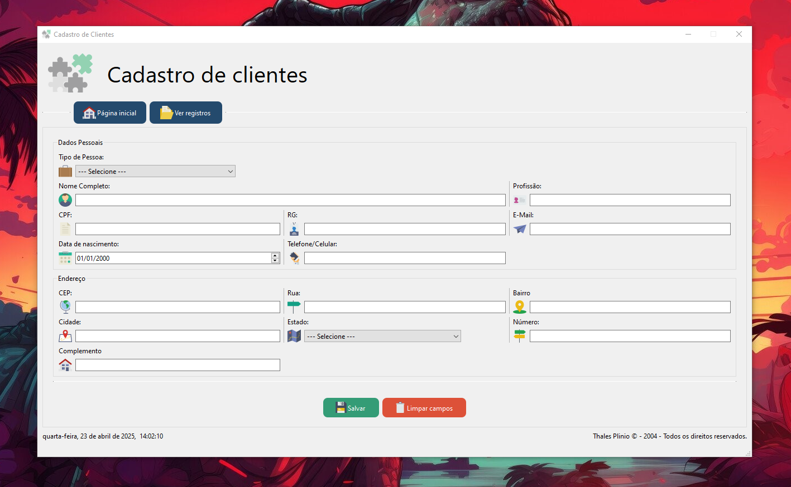
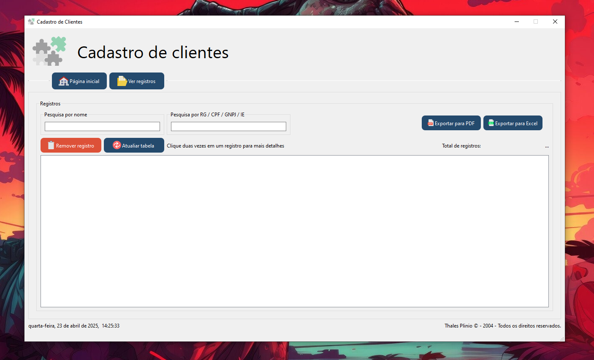

# Cadastro de Clientes

[](<(https://github.com/thalesplinio/cadastroDeClientes/blob/main/LICENSE)>)
[](https://github.com/thalesplinio/SistemaCadastroDeClientes/blob/main/LICENSE)

<p align="center">
    
</p>


> Status: Em desenvolvimento...</br>
> Plataforma: Windows </br>

## Pequena aplicação para cadastrar clientes, usando Python e sqlite3 com interface gráfica.

### Sobre o Projeto:

> Este projeto foi feito para fins de estudo, desenvolvido pra cadastrar clientes de empresas substituindo assim o uso de planilhas Excel. </br>
> Cadastro, visualização, pesquisa, alteração e remoção de registro. </br>
> usando banco de dados SQLite3 com a possibilidade de exportar esses registros em formato excel e pdf.

## Tecnologias e bibliotecas utilizadas.

- Python 3.12.3
- API [ViaCep](https://viacep.com.br/)
- SQLite3

## Iniciando o projeto.

- Para Windows
  > Ao iniciar o projeto crie um ambiente virtual

```python
# Criando ambiente virtual
python -m venv venv

# Ativando o ambiente virtual
venv/bin/activate
```

- Instale as dependências do projeto contidas em requirements.txt

```python
# No terminal execute
pip install -r requirements.txt
```

- <em>Tudo pronto agora inicie o projeto</em>
<hr>

## Apresentação do projeto.

### 📌 Tela inicial.

> - Essa é a tela inicial do projeto, aqui é aonde vamos inserir os dados do cliente.

> - No tipo de pessoa temos um combobox para informar se é uma pessoa física ou juridica, ao selecionar pessoa física aparecem os campos CPF e RG, e se for uma pessa Jurídica aparece os campos CNPJ e IE, assim como o campo data, que na pessoa física informa a data de nascimento e para pessoa jurídica informa a data de abertura.

> - No campo CEP, estou usando uma API 'viacep' para coletar os dados recebidos, quando o usuário insere um cep válido os campos
>   (Endereço, Bairro, Cidade e Estado) são preenchidos automaticamente e aparece um ✅ 'check' informando visualmente que o cep foi encontrado.
>   E se o usuário preencher um cep que não for válido nada acontece.

<p align="center">
    
</p>

### 📌 Tela de registros.

> - Na tela de registros é onde vão ficar os dados armazenados para visualização, tendo a opção de fazer buscas por nome, por RG, CPF, CNPJ e IE(inscrição estadual)

> - Onde tem também a opção de exportar para PDF ou EXCEL,

> - Ao dar um clique duplo sobre a tabele abre-se um popup para mais informações.

<p align="center">
    
</p>

Autor: Thales Plinio
